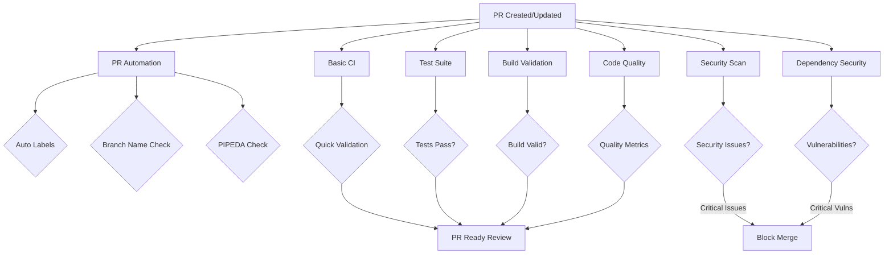

# GitHub Actions Workflows

Comprehensive CI/CD automation for the NestSync project using GitHub Actions.

## Overview

NestSync uses GitHub Actions to automate code review, testing, security scanning, and quality checks. All workflows are designed to work together to ensure high code quality, security compliance, and PIPEDA regulatory compliance.

## Workflow Catalog

### 1. Security Scan (`security-scan.yml`)

**Purpose**: Comprehensive security analysis using multiple tools

**Triggers**:
- Pull requests to main/develop
- Pushes to main/develop
- Weekly schedule (Mondays at 9 AM UTC)
- Manual workflow dispatch

**Jobs**:
- **Semgrep Security Analysis**: Multi-language security scanning (Python, TypeScript, React)
- **Bandit Python Security**: Python-specific security checks
- **ESLint Security Check**: JavaScript/TypeScript security linting
- **Security Summary**: Consolidated results

**Key Features**:
- Tracks and validates suppressed findings
- Enforces suppression documentation
- Blocks merge on critical security issues
- Automated PR comments with findings
- Comprehensive artifact uploads

**Configuration Files**:
- `.semgrep-suppression-baseline` - Baseline suppression count
- `docs/security/semgrep-false-positives.md` - False positive registry
- `docs/security/suppression-audit-log.md` - Audit log
- `tests/validate-suppressions.sh` - Validation script

### 2. Basic CI (`basic-ci.yml`)

**Purpose**: Quick syntax validation and basic checks

**Triggers**:
- Pushes to main, develop, feature branches
- Pull requests to main/develop

**Jobs**:
- **Frontend Linting**: ESLint checks (non-blocking)
- **Backend Syntax Check**: Python compilation validation
- **Security Scan**: Basic secret scanning and credential checks

**Key Features**:
- Fast feedback on basic issues
- Non-blocking ESLint for gradual improvement
- Secret detection (excludes templates and test data)

### 3. Test Suite (`test.yml`)

**Purpose**: Comprehensive testing across frontend and backend

**Triggers**:
- Pushes to main, develop, claude/**, feature/** branches
- Pull requests to main/develop
- Manual workflow dispatch

**Jobs**:
- **Frontend Tests**: TypeScript type checking, ESLint, unit tests (if configured)
- **Backend Tests**: Python syntax, mypy type checking, pytest
- **Integration Tests**: Full stack health checks and GraphQL validation
- **Test Summary**: Consolidated results

**Key Features**:
- PostgreSQL service for backend tests
- Coverage reporting (uploaded as artifacts)
- Health checks for integration testing
- Graceful handling of missing test frameworks

**Environment Variables**:
- `DATABASE_URL`: Test database connection
- `TESTING`: Flag for test environment

### 4. Build Validation (`build.yml`)

**Purpose**: Validate builds and configurations

**Triggers**:
- Pushes to main/develop
- Pull requests to main/develop
- Manual workflow dispatch

**Jobs**:
- **Frontend Build Check**: Expo configuration, TypeScript, build scripts
- **Backend Validation**: Python syntax, imports, migrations, environment templates
- **Docker Build**: Validate Docker images and docker-compose configuration
- **Build Summary**: Consolidated results

**Key Features**:
- Expo configuration validation
- Database migration file counting
- Environment template validation
- Docker image build testing

### 5. Dependency Security (`dependency-security.yml`)

**Purpose**: Monitor and report dependency vulnerabilities

**Triggers**:
- Pushes to main/develop
- Pull requests to main/develop
- Weekly schedule (Mondays at 10 AM UTC)
- Manual workflow dispatch

**Jobs**:
- **NPM Audit**: JavaScript dependency vulnerability scanning
- **pip-audit**: Python dependency vulnerability scanning (with Safety check)
- **Dependency Review**: GitHub native dependency review (PR only)
- **Outdated Dependencies**: Check for outdated packages (scheduled runs)
- **Dependency Summary**: Consolidated results

**Key Features**:
- Blocks merge on critical npm vulnerabilities
- Multiple Python security tools (pip-audit + Safety)
- Automated PR comments with vulnerability details
- Weekly outdated package reports

**Artifacts**:
- npm audit results (JSON + text)
- pip audit results (JSON + text)
- Safety check results
- Outdated package lists

### 6. Code Quality (`code-quality.yml`)

**Purpose**: Enforce code quality standards and complexity metrics

**Triggers**:
- Pushes to main/develop
- Pull requests to main/develop
- Manual workflow dispatch

**Jobs**:
- **TypeScript Quality Check**: Type checking, complexity analysis
- **Python Quality Check**: mypy, black, isort, pylint, radon
- **Code Metrics**: Lines of code, file counts
- **Quality Summary**: Consolidated results

**Key Features**:
- TypeScript type error reporting
- Python code style enforcement (black, isort)
- Pylint quality scoring
- Cyclomatic complexity analysis (radon)
- Maintainability index calculation

**Artifacts**:
- Type checking reports (TypeScript + mypy)
- Code style reports (black, isort)
- Pylint JSON and text reports
- Radon complexity analysis

### 7. PR Automation (`pr-automation.yml`)

**Purpose**: Automate PR management and validation

**Triggers**:
- Pull request events (opened, edited, synchronize, reopened, labeled, unlabeled)

**Jobs**:
- **Auto Label**: Automatically label PRs based on changed files
- **Check PR Description**: Validate PR description quality
- **Check Branch Name**: Enforce branch naming conventions
- **Check PIPEDA Compliance**: Flag changes requiring PIPEDA review
- **Check Merge Conflicts**: Detect merge conflicts early
- **PR Summary**: Consolidated automation results

**Key Features**:
- Automatic labels: frontend, backend, documentation, tests, ci/cd, docker
- Size labels: XS, S, M, L, XL based on change count
- PIPEDA compliance reminders for sensitive changes
- Branch naming validation (feature/*, bugfix/*, hotfix/*, claude/*, etc.)
- PR description quality checks

**Valid Branch Patterns**:
- `feature/*` - New features
- `bugfix/*` - Bug fixes
- `hotfix/*` - Urgent fixes
- `claude/*` - Claude Code automation
- `docs/*` - Documentation updates
- `refactor/*` - Code refactoring
- `test/*` - Test updates

## Workflow Dependencies



## Best Practices

### For Developers

1. **Before Creating a PR**:
   - Run `npm run lint` in frontend
   - Run `black app/ && isort app/` in backend
   - Ensure tests pass locally
   - Check for secrets and credentials

2. **PR Description Template**:
   ```markdown
   ## Changes
   - Brief list of changes

   ## Testing
   - How changes were tested
   - Test credentials used (if applicable)

   ## PIPEDA Compliance
   - [ ] No changes to authentication/consent/privacy
   - [ ] OR: Compliance checklist completed
   ```

3. **Branch Naming**:
   - Use descriptive names: `feature/add-user-profile`
   - Follow conventions: `feature/*`, `bugfix/*`, `hotfix/*`

4. **Handling Failed Workflows**:
   - Check workflow logs in GitHub Actions tab
   - Download artifacts for detailed reports
   - Fix issues locally before pushing

### For Security

1. **Suppressing Security Findings**:
   - Add `# nosemgrep: rule-id` or `// nosemgrep: rule-id`
   - Document in `docs/security/semgrep-false-positives.md`
   - Add audit log entry
   - Update `.semgrep-suppression-baseline`

2. **Critical Vulnerabilities**:
   - Address immediately (blocks merge)
   - Use `npm audit fix` or `pip install --upgrade`
   - Document security decisions

3. **PIPEDA Compliance**:
   - Review checklist for auth/database/API changes
   - Ensure Canadian data residency
   - Maintain audit trails
   - Update RLS policies

### For Maintainers

1. **Workflow Updates**:
   - Test changes in feature branches first
   - Use `workflow_dispatch` for manual testing
   - Monitor workflow execution times
   - Update documentation when adding workflows

2. **Managing Artifacts**:
   - Artifacts retained for 30 days (7 days for builds)
   - Download critical reports before expiration
   - Archive important findings in documentation

3. **Scheduled Workflows**:
   - Security scan: Weekly (Mondays 9 AM UTC)
   - Dependency check: Weekly (Mondays 10 AM UTC)
   - Review reports and create issues as needed

## Artifact Retention

| Workflow | Artifact | Retention |
|----------|----------|-----------|
| Security Scan | Semgrep results, suppression reports | 30 days |
| Test Suite | Coverage reports | 30 days |
| Build Validation | Build artifacts | 7 days |
| Dependency Security | Audit reports | 30 days |
| Code Quality | Quality reports | 30 days |

## Troubleshooting

### Workflow Not Triggering

**Symptoms**: Workflow doesn't run on PR or push

**Solutions**:
1. Check branch patterns in workflow `on:` section
2. Verify permissions in repository settings
3. Check if workflow is disabled
4. Review GitHub Actions usage limits

### Failing Type Checks

**Symptoms**: TypeScript or mypy failures

**Solutions**:
1. Run `npx tsc --noEmit` locally (frontend)
2. Run `mypy app/` locally (backend)
3. Install type stubs: `mypy --install-types`
4. Check for type annotation errors

### Dependency Vulnerabilities

**Symptoms**: npm or pip audit failures

**Solutions**:
1. Review artifact reports for details
2. Use `npm audit fix` for automatic fixes
3. Manually upgrade vulnerable packages
4. Document workarounds if no fix available

### Docker Build Failures

**Symptoms**: Docker build job fails

**Solutions**:
1. Test locally: `docker build -f docker/Dockerfile.backend .`
2. Check for missing files in Dockerfile
3. Verify build context includes necessary files
4. Review build logs in artifact

### Security Scan False Positives

**Symptoms**: Semgrep reports non-issues

**Solutions**:
1. Review finding details in artifacts
2. Add suppression comment: `# nosemgrep: rule-id`
3. Document in `docs/security/semgrep-false-positives.md`
4. Update suppression baseline
5. Add audit log entry

## Performance Optimization

### Concurrency Control

All workflows use concurrency groups to cancel in-progress runs:

```yaml
concurrency:
  group: ${{ github.workflow }}-${{ github.ref }}
  cancel-in-progress: true
```

### Caching

Workflows leverage GitHub Actions caching:
- Node.js: npm cache by `package-lock.json`
- Python: pip cache by `requirements.txt`

### Parallel Execution

Independent jobs run in parallel:
- Security scan jobs run concurrently
- Test jobs run independently
- Quality checks run in parallel

## Workflow Execution Time

| Workflow | Typical Duration | Max Duration |
|----------|------------------|--------------|
| Basic CI | 2-3 minutes | 5 minutes |
| Security Scan | 5-8 minutes | 15 minutes |
| Test Suite | 5-10 minutes | 20 minutes |
| Build Validation | 3-5 minutes | 10 minutes |
| Dependency Security | 3-5 minutes | 10 minutes |
| Code Quality | 5-8 minutes | 15 minutes |
| PR Automation | 1-2 minutes | 5 minutes |

## Environment Variables

### Test Suite

- `DATABASE_URL`: PostgreSQL connection for tests
- `TESTING`: Flag to enable test mode

### Security Scan

- None (uses default configurations)

### Build Validation

- None (validates templates and configs)

## GitHub Actions Permissions

Workflows require these permissions:

```yaml
permissions:
  contents: read          # Read repository contents
  pull-requests: write    # Comment on PRs
  issues: write           # Manage labels
```

## Integration with External Services

### Future Integrations

- **Codecov**: Code coverage reporting
- **SonarQube**: Additional quality metrics
- **Dependabot**: Automated dependency updates
- **Slack**: Workflow notifications
- **Railway**: Deployment automation

## Contributing

When adding new workflows:

1. Follow existing naming conventions
2. Add comprehensive documentation
3. Use concurrency control
4. Implement caching where applicable
5. Add summary outputs for easy review
6. Upload relevant artifacts
7. Update this README

## References

- [GitHub Actions Documentation](https://docs.github.com/en/actions)
- [NestSync CLAUDE.md](../../CLAUDE.md)
- [Security Documentation](../../docs/security/)
- [PIPEDA Compliance](../../docs/compliance/pipeda/)
