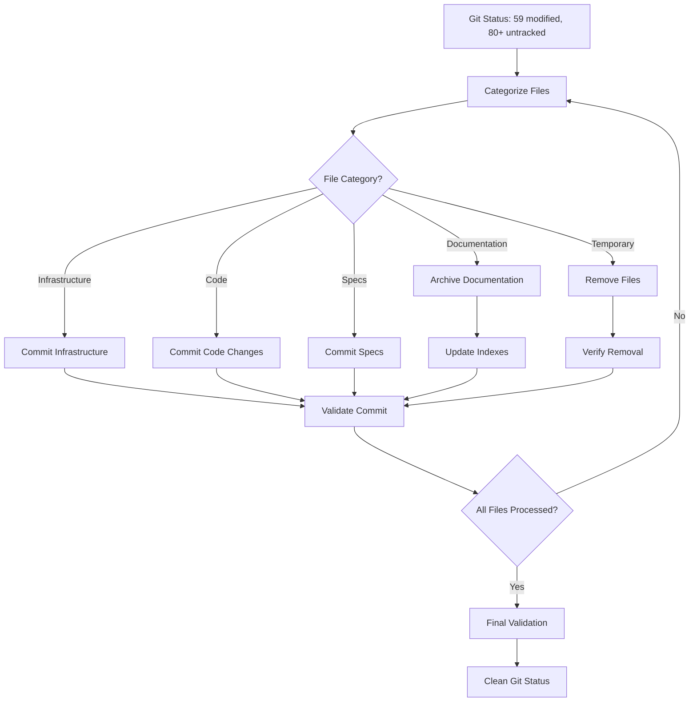
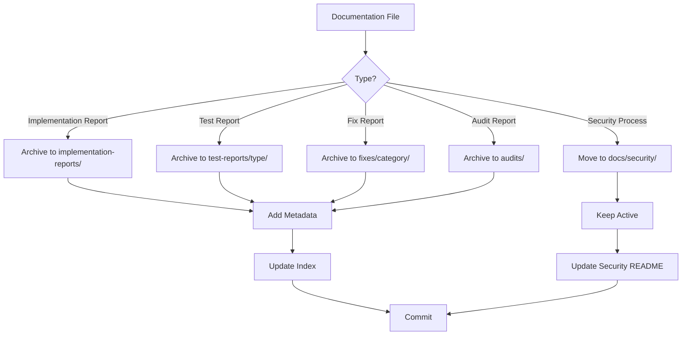

# Design Document

## Overview

This design outlines a systematic approach to cleaning up the current git status, which shows 59 modified files and 80+ untracked files. The cleanup will be organized into logical phases that group related files together, following the established documentation standards and ensuring all changes are properly committed or archived.

The design prioritizes efficiency by:
1. Categorizing files by type and purpose
2. Processing files in logical groups
3. Automating validation where possible
4. Creating clear commit boundaries
5. Following established documentation standards

## Architecture

### Cleanup Phases

The cleanup process is organized into 6 main phases:

```
Phase 1: Infrastructure & Configuration Files
├── Security scanning configuration
├── CI/CD workflows
├── Pre-commit hooks
└── Git hooks

Phase 2: Code Changes
├── Backend code modifications
├── Frontend code modifications
└── New feature implementations

Phase 3: Documentation Archival
├── Implementation reports → archives
├── Test reports → archives
└── Security validation reports → docs/security

Phase 4: Spec Directories
├── semgrep-false-positive-management
└── testsprite-issues-resolution

Phase 5: Cleanup & Consolidation
├── Remove temporary files
├── Consolidate duplicates
└── Remove orphaned files

Phase 6: Validation & Final Commit
├── Verify clean git status
├── Validate links
└── Create cleanup summary
```

### File Categorization Strategy

Files are categorized into 5 groups:

1. **COMMIT_INFRASTRUCTURE**: Files needed for CI/CD, security, and development workflows
2. **COMMIT_CODE**: Application code changes (backend/frontend)
3. **ARCHIVE_DOCS**: Documentation that should be archived per standards
4. **COMMIT_SPECS**: Spec directories for feature planning
5. **REMOVE_TEMP**: Temporary files and artifacts to be removed

## Components and Interfaces

### Component 1: File Categorizer

**Purpose**: Analyze all modified and untracked files and assign them to appropriate categories.

**Input**: Git status output (modified and untracked files)

**Output**: Categorized file lists with recommended actions

**Logic**:
```
For each file:
  If file matches infrastructure patterns (.github/, .pre-commit, .semgrep, etc.):
    → COMMIT_INFRASTRUCTURE
  Else if file is in backend/frontend code directories:
    → COMMIT_CODE
  Else if file matches documentation report patterns:
    If file is implementation/test report:
      → ARCHIVE_DOCS
    Else if file is security/process documentation:
      → COMMIT_INFRASTRUCTURE (to docs/security)
  Else if file is in .kiro/specs/:
    → COMMIT_SPECS
  Else if file matches temporary patterns (.json reports, etc.):
    → REMOVE_TEMP
```

### Component 2: Archive Manager

**Purpose**: Move documentation files to appropriate archive directories following documentation standards.

**Input**: List of files to archive

**Output**: Archived files with metadata, updated indexes

**Process**:
1. Determine archive destination based on file type:
   - Implementation reports → `docs/archives/implementation-reports/[feature]/`
   - Test reports → `docs/archives/test-reports/[type]/`
   - Security validation → `docs/security/` (active, not archived)
   - Fix reports → `docs/archives/fixes/[category]/`

2. Add metadata frontmatter:
   ```yaml
   ---
   title: "Report Title"
   date: 2025-11-11
   category: "category-name"
   status: "resolved|completed"
   impact: "high|medium|low"
   ---
   ```

3. Update archive indexes:
   - Add entry to category README.md
   - Update master archive index
   - Create cross-references

### Component 3: Commit Orchestrator

**Purpose**: Create logical, well-organized commits grouped by functional area.

**Input**: Categorized file lists

**Output**: Series of git commits with descriptive messages

**Commit Strategy**:
```
Commit 1: Infrastructure & Security Configuration
- .github/workflows/security-scan.yml
- .pre-commit-config.yaml (root and backend)
- .secrets.baseline
- .semgrep.yml, .semgrep-suppression-baseline
- .bandit configuration

Commit 2: Backend Code Changes
- Group by functional area:
  - Authentication changes
  - Stripe/payment changes
  - GraphQL changes
  - Database/config changes
  - New utilities

Commit 3: Frontend Code Changes
- Group by functional area:
  - Authentication screens
  - Subscription management
  - Analytics components
  - Chart components
  - UI components
  - Configuration

Commit 4: Test Infrastructure
- Test scripts
- Validation scripts
- Git hooks setup
- Playwright tests

Commit 5: New Features
- Backend: logging utility, test utilities
- Frontend: reset-password screen, Stripe config

Commit 6: Spec Directories
- semgrep-false-positive-management spec
- testsprite-issues-resolution spec

Commit 7: Documentation Organization
- Archived implementation reports
- Archived test reports
- Security documentation updates
- Archive index updates
```

### Component 4: Validation Engine

**Purpose**: Verify cleanup completeness and correctness.

**Checks**:
1. **Git Status Check**: Verify working tree is clean
2. **Link Integrity**: Validate all markdown links resolve
3. **Archive Structure**: Verify all archived docs have metadata
4. **Code Quality**: Verify no syntax/lint errors in committed code
5. **Documentation Standards**: Verify compliance with documentation standards

## Data Models

### File Categorization Record

```typescript
interface FileCategorization {
  path: string;
  status: 'modified' | 'untracked';
  category: 'COMMIT_INFRASTRUCTURE' | 'COMMIT_CODE' | 'ARCHIVE_DOCS' | 'COMMIT_SPECS' | 'REMOVE_TEMP';
  action: 'commit' | 'archive' | 'remove';
  destination?: string; // For archive actions
  commitGroup?: string; // For commit actions
  reason: string; // Explanation for categorization
}
```

### Archive Entry

```typescript
interface ArchiveEntry {
  sourcePath: string;
  destinationPath: string;
  metadata: {
    title: string;
    date: string;
    category: string;
    status: string;
    impact?: string;
    priority?: string;
    relatedDocs?: string[];
    tags?: string[];
  };
  indexUpdates: string[]; // Paths to README.md files to update
}
```

### Commit Group

```typescript
interface CommitGroup {
  name: string;
  message: string;
  files: string[];
  order: number; // Execution order
}
```

## Error Handling

### File Conflicts
- **Issue**: File already exists at archive destination
- **Resolution**: Check if content is identical; if not, append date suffix to filename

### Broken Links
- **Issue**: Archived file contains links that will break after move
- **Resolution**: Update links to use relative paths before archiving

### Missing Metadata
- **Issue**: Cannot determine appropriate archive location
- **Resolution**: Default to `docs/archives/2025/11-november/` with manual review flag

### Commit Failures
- **Issue**: Git commit fails due to errors
- **Resolution**: Roll back changes, fix errors, retry

### Validation Failures
- **Issue**: Code has syntax errors or lint issues
- **Resolution**: Fix errors before committing, or document as known issues

## Testing Strategy

### Pre-Cleanup Validation
1. Create backup of current state
2. Verify git status matches expected file counts
3. Verify no uncommitted changes in critical files

### During Cleanup Validation
1. After each archive operation:
   - Verify file moved successfully
   - Verify metadata added correctly
   - Verify index updated

2. After each commit:
   - Verify files staged correctly
   - Verify commit message is descriptive
   - Verify no unintended files included

### Post-Cleanup Validation
1. Verify `git status` shows clean working tree
2. Run link validation on all markdown files
3. Verify archive structure compliance
4. Verify all modified code files have no errors
5. Generate cleanup summary report

## Implementation Approach

### Phase 1: Analysis & Planning
1. Run git status and capture output
2. Categorize all files using File Categorizer
3. Generate categorization report for review
4. Identify any edge cases or conflicts

### Phase 2: Infrastructure Commits
1. Stage infrastructure files
2. Verify configurations are valid
3. Commit with descriptive message
4. Verify commit successful

### Phase 3: Code Commits
1. Group code changes by functional area
2. Run diagnostics on modified code
3. Fix any errors found
4. Commit each group separately
5. Verify commits successful

### Phase 4: Documentation Archival
1. Process implementation reports
2. Process test reports
3. Process security documentation
4. Update all archive indexes
5. Commit archived documentation

### Phase 5: Spec & Feature Commits
1. Verify spec directories are complete
2. Commit spec directories
3. Commit new feature code
4. Verify commits successful

### Phase 6: Cleanup & Validation
1. Remove temporary files
2. Verify git status is clean
3. Run validation checks
4. Generate cleanup summary
5. Create final commit if needed

## Design Decisions

### Decision 1: Commit Granularity
**Choice**: Create multiple focused commits rather than one large commit

**Rationale**: 
- Easier to review changes
- Easier to revert specific changes if needed
- Better git history for future reference
- Follows best practices for version control

### Decision 2: Archive vs Active Documentation
**Choice**: Follow documentation standards strictly - archive implementation/test reports, keep security/process docs active

**Rationale**:
- Maintains consistency with established standards
- Security documentation needs to be easily accessible
- Implementation reports are historical reference
- Prevents documentation directory from becoming cluttered

### Decision 3: Temporary File Removal
**Choice**: Remove JSON report files and other temporary artifacts

**Rationale**:
- These files are generated artifacts, not source
- Information is captured in markdown reports
- Reduces repository size
- Prevents confusion about which files are authoritative

### Decision 4: Spec Directory Handling
**Choice**: Commit spec directories as-is without modification

**Rationale**:
- Specs represent planning and design work
- Should be preserved for future reference
- May be incomplete but still valuable
- Can be completed in future work

### Decision 5: Modified File Grouping
**Choice**: Group modified files by functional area rather than by directory

**Rationale**:
- Creates more meaningful commit messages
- Easier to understand what changed and why
- Aligns with how developers think about changes
- Better for code review and git history

## Cross-References

- [Documentation Standards](.kiro/steering/documentation-standards.md) - Rules for archiving
- [Archive Structure](docs/archives/README.md) - Current archive organization
- [Documentation Guide](docs/DOCUMENTATION_GUIDE.md) - Maintenance instructions

## Diagrams

### Cleanup Flow



### Archive Decision Tree



## Success Criteria

1. ✅ Git status shows clean working tree (0 modified, 0 untracked)
2. ✅ All infrastructure files committed and functional
3. ✅ All code changes committed with no errors
4. ✅ All documentation archived per standards
5. ✅ All archive indexes updated
6. ✅ All links validated and working
7. ✅ Cleanup summary generated
8. ✅ Repository synchronized with remote
