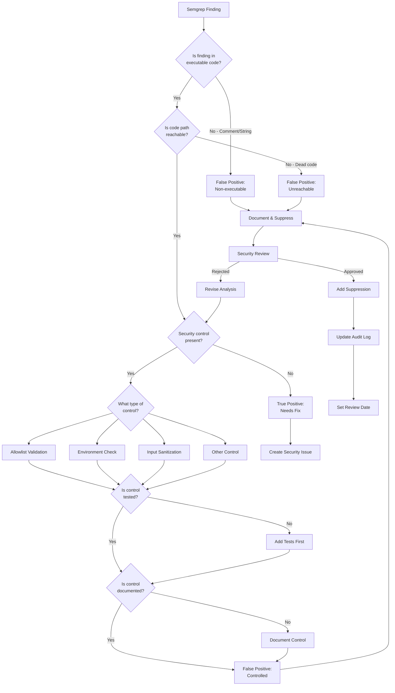
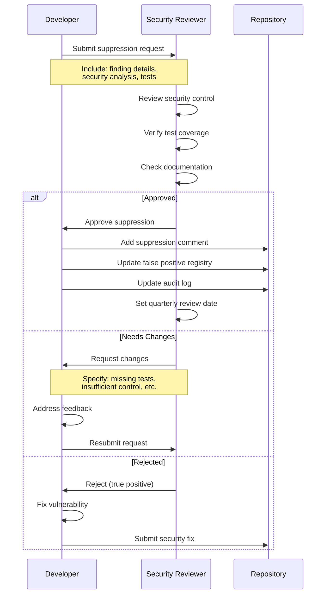

# False Positive Review Process

## Overview

This document defines the standardized process for evaluating Semgrep security findings and determining whether they represent true vulnerabilities or false positives. The process ensures consistent decision-making, proper documentation, and ongoing validation of suppressed findings.

**Purpose**: Provide a systematic approach to:
- Evaluate security scan findings objectively
- Document suppression decisions with proper justification
- Maintain security posture while reducing noise from false positives
- Ensure compliance with security review requirements

**Scope**: All Semgrep findings across NestSync backend (Python/FastAPI) and frontend (TypeScript/React Native)

**Last Updated**: 2025-11-10

---

## Roles and Responsibilities

### Security Reviewer
**Responsibilities**:
- Perform initial evaluation of all Semgrep findings
- Conduct security control analysis
- Approve or reject suppression requests
- Maintain false positive registry
- Conduct quarterly reviews

**Required Skills**:
- Understanding of OWASP Top 10 vulnerabilities
- Knowledge of secure coding practices
- Familiarity with NestSync architecture

### Developer
**Responsibilities**:
- Report potential false positives
- Provide context on flagged code
- Implement security controls if needed
- Add suppression comments after approval
- Write validation tests

### DevOps Engineer
**Responsibilities**:
- Monitor CI/CD security scan results
- Track suppression baseline metrics
- Alert on new suppressions
- Maintain Semgrep configuration

---

## Evaluation Workflow



---

## Decision Criteria

### Step 1: Code Execution Analysis

**Question**: Is the finding in executable code?

**Check for**:
- Comments (single-line `//` or `#`, multi-line `/* */`)
- String literals in error messages
- Documentation strings
- Example code in comments

**Decision**:
- ✅ **False Positive** if in comments or non-executable strings
- ⏭️ **Continue evaluation** if in executable code

**Example - False Positive**:
```typescript
// Example: Don't use ws:// in production, always use wss://
// This is just a comment explaining the security pattern
```

**Example - Needs Evaluation**:
```typescript
const url = protocol === 'https' ? 'wss://' : 'ws://';
// This is executable code that needs security analysis
```

---

### Step 2: Reachability Analysis

**Question**: Can this code path be executed?

**Check for**:
- Dead code after return statements
- Unreachable branches
- Deprecated functions no longer called
- Development-only code paths

**Decision**:
- ✅ **False Positive** if unreachable
- ⏭️ **Continue evaluation** if reachable

---

### Step 3: Security Control Analysis

**Question**: Is there a security control that mitigates the risk?

**Common Security Controls**:

#### Allowlist Validation
```python
ALLOWED_TIMEZONES = ['America/Toronto', 'America/Vancouver', ...]

def set_timezone(cursor, timezone: str):
    if timezone not in ALLOWED_TIMEZONES:
        raise ValueError(f"Invalid timezone: {timezone}")
    cursor.execute("SET timezone = %s", (timezone,))
```

**Evaluation**:
- ✅ Input validated against predefined list
- ✅ No user input directly in query
- ✅ Parameterized query used

#### Environment-Based Security
```typescript
const getWebSocketUrl = (httpUrl: string): string => {
  if (process.env.NODE_ENV === 'production') {
    return httpUrl.replace('https://', 'wss://');
  }
  return httpUrl.replace('http://', 'ws://');
};
```

**Evaluation**:
- ✅ Production enforces secure protocol
- ✅ Development uses appropriate protocol
- ✅ No hardcoded insecure URLs

#### Input Sanitization
```python
def sanitize_input(user_input: str) -> str:
    # Remove special characters
    return re.sub(r'[^\w\s-]', '', user_input)
```

**Evaluation**:
- ✅ Input cleaned before use
- ✅ Dangerous characters removed
- ✅ Validation logic tested

**Decision**:
- ✅ **False Positive** if proper control exists and is tested
- ❌ **True Positive** if no control or control is insufficient

---

### Step 4: Test Coverage Analysis

**Question**: Is the security control validated by automated tests?

**Required Test Coverage**:
- ✅ Test that valid inputs are accepted
- ✅ Test that invalid inputs are rejected
- ✅ Test that attack patterns are blocked
- ✅ Test that control cannot be bypassed

**Example - SQL Injection Prevention**:
```python
def test_timezone_validation_rejects_invalid():
    """Verify ALLOWED_TIMEZONES prevents SQL injection."""
    with pytest.raises(ValueError):
        set_timezone(cursor, "'; DROP TABLE users; --")

def test_timezone_validation_accepts_valid():
    """Verify valid timezones work correctly."""
    set_timezone(cursor, "America/Toronto")
    # Verify timezone was set
```

**Decision**:
- ✅ **Proceed to documentation** if tests exist and pass
- ⏸️ **Add tests first** if no test coverage

---

### Step 5: Documentation Requirements

**Question**: Is the security control properly documented?

**Required Documentation**:
1. **Code Comments**: Explain why the control is necessary
2. **False Positive Registry**: Entry in `semgrep-false-positives.md`
3. **Suppression Comment**: Inline nosemgrep with justification
4. **Audit Log**: Entry in `suppression-audit-log.md`

**Decision**:
- ✅ **Ready for suppression** if documented
- ⏸️ **Document first** if missing documentation

---

## Examples: True Positives vs False Positives

### Example 1: SQL Injection - FALSE POSITIVE

**Finding**: `python.lang.security.audit.formatted-sql-query`

**Code**:
```python
ALLOWED_TIMEZONES = ['America/Toronto', 'America/Vancouver', ...]

def set_timezone(cursor, timezone: str):
    if timezone not in ALLOWED_TIMEZONES:
        raise ValueError(f"Invalid timezone: {timezone}")
    cursor.execute("SET timezone = %s", (timezone,))
```

**Analysis**:
- ✅ In executable code
- ✅ Code is reachable
- ✅ Allowlist validation present
- ✅ Tests validate control
- ✅ Documented

**Decision**: FALSE POSITIVE - Safe to suppress

---

### Example 2: SQL Injection - TRUE POSITIVE

**Finding**: `python.lang.security.audit.formatted-sql-query`

**Code**:
```python
def search_users(search_term: str):
    query = f"SELECT * FROM users WHERE name LIKE '%{search_term}%'"
    cursor.execute(query)
```

**Analysis**:
- ✅ In executable code
- ✅ Code is reachable
- ❌ No input validation
- ❌ Direct string interpolation
- ❌ No parameterization

**Decision**: TRUE POSITIVE - Needs fix

**Fix**:
```python
def search_users(search_term: str):
    query = "SELECT * FROM users WHERE name LIKE %s"
    cursor.execute(query, (f"%{search_term}%",))
```

---

### Example 3: WebSocket Security - FALSE POSITIVE

**Finding**: `javascript.lang.security.audit.insecure-websocket`

**Code**:
```typescript
// Security Note: Always use wss:// in production
// Example of insecure connection: ws://example.com
// This should only be used in local development
```

**Analysis**:
- ❌ Not in executable code (comment only)
- N/A Other checks not needed

**Decision**: FALSE POSITIVE - Comment explaining security

---

### Example 4: WebSocket Security - TRUE POSITIVE

**Finding**: `javascript.lang.security.audit.insecure-websocket`

**Code**:
```typescript
const WEBSOCKET_URL = 'ws://api.nestsync.ca/subscriptions';

const client = new WebSocket(WEBSOCKET_URL);
```

**Analysis**:
- ✅ In executable code
- ✅ Code is reachable
- ❌ Hardcoded insecure protocol
- ❌ No environment check
- ❌ Production uses insecure connection

**Decision**: TRUE POSITIVE - Needs fix

**Fix**:
```typescript
const getWebSocketUrl = (): string => {
  const protocol = window.location.protocol === 'https:' ? 'wss:' : 'ws:';
  return `${protocol}//api.nestsync.ca/subscriptions`;
};
```

---

## Approval Workflow

### Suppression Request Process



### Approval Authority

**Who Can Approve Suppressions**:
- Security Team Lead
- Senior Security Engineer
- DevOps Lead (for infrastructure-related findings)

**Approval Requirements**:
- ✅ Security control analysis completed
- ✅ Test coverage verified
- ✅ Documentation prepared
- ✅ No alternative fix available
- ✅ Risk assessment documented

### Timeline Expectations

| Stage | Timeline | Owner |
|-------|----------|-------|
| Initial Review | 1 business day | Security Reviewer |
| Security Analysis | 2-3 business days | Developer + Security Reviewer |
| Test Development | 1-2 business days | Developer |
| Documentation | 1 business day | Developer |
| Final Approval | 1 business day | Security Reviewer |
| **Total** | **5-7 business days** | |

**Expedited Process**: For urgent production issues, approval can be expedited to 1-2 business days with proper justification.

---

## Escalation Criteria

### When to Escalate to Security Team

Escalate if:
- ❗ Finding involves authentication or authorization
- ❗ Finding relates to data encryption or PII handling
- ❗ Uncertainty about whether control is sufficient
- ❗ Finding appears in critical production code path
- ❗ Multiple similar findings across codebase
- ❗ Finding involves third-party dependencies
- ❗ Compliance implications (PIPEDA, PCI-DSS, etc.)

### Escalation Process

1. **Create Security Issue**: Use GitHub Security Advisory
2. **Tag Security Team**: `@security-team` in issue
3. **Provide Context**: Include full analysis and code context
4. **Set Priority**: P0 (Critical), P1 (High), P2 (Medium), P3 (Low)
5. **Block Deployment**: If P0 or P1, block production deployment

---

## Quarterly Review Schedule

### Review Calendar

| Quarter | Review Month | Review Date | Scope |
|---------|--------------|-------------|-------|
| Q1 | February | February 10 | All suppressions from previous year |
| Q2 | May | May 10 | Q1 suppressions + new additions |
| Q3 | August | August 10 | Q2 suppressions + new additions |
| Q4 | November | November 10 | Q3 suppressions + new additions |

### Review Process

**Preparation** (1 week before):
1. Generate list of all active suppressions
2. Identify suppressions due for review
3. Assign reviewers to each suppression
4. Schedule review meeting

**Review Meeting** (2 hours):
1. Review each suppression systematically
2. Verify security controls still exist
3. Confirm tests still pass
4. Check for code changes affecting control
5. Update documentation if needed

**Post-Review Actions**:
1. Update review dates in registry
2. Remove outdated suppressions
3. Add new tests if gaps identified
4. Update audit log with review results

### What to Check During Reviews

For each suppression, verify:

✅ **Security Control Intact**
- Control code hasn't been modified
- Control logic still sound
- No bypass paths introduced

✅ **Tests Still Valid**
- All validation tests pass
- Tests cover current code
- No tests disabled or skipped

✅ **Documentation Current**
- Registry entry accurate
- Suppression comment clear
- Audit log up to date

✅ **Code Still Relevant**
- Code path still in use
- Feature not deprecated
- No refactoring needed

### Removing Outdated Suppressions

**Criteria for Removal**:
- Code has been refactored and finding no longer applies
- Security control has been removed (must fix vulnerability first)
- Feature has been deprecated
- Better solution implemented

**Removal Process**:
1. Remove suppression comment from code
2. Update false positive registry (mark as "Resolved")
3. Add removal entry to audit log
4. Update suppression baseline count
5. Re-run Semgrep to verify no new findings

---

## Suppression Comment Standards

### Python Format

```python
# nosemgrep: [rule-id]
# Security Control: [description of mitigation]
# Validated By: [test reference]
[flagged code]
```

**Example**:
```python
# nosemgrep: python.lang.security.audit.formatted-sql-query
# Security Control: timezone validated against ALLOWED_TIMEZONES allowlist (lines 15-21)
# Validated By: tests/security/test_sql_injection.py::test_timezone_validation_rejects_invalid
cursor.execute("SET timezone = %s", (settings.timezone,))
```

### TypeScript/JavaScript Format

```typescript
// nosemgrep: [rule-id]
// Security Control: [description of mitigation]
// Validated By: [test reference]
[flagged code]
```

**Example**:
```typescript
// nosemgrep: javascript.lang.security.audit.insecure-websocket
// Security Control: Production enforces wss:// via getWebSocketUrl() environment check
// Validated By: tests/security/test_websocket_encryption.spec.ts
const url = getWebSocketUrl(apiUrl);
```

### Comment Requirements

All suppression comments MUST include:
1. ✅ Rule ID being suppressed
2. ✅ Description of security control
3. ✅ Reference to validation tests
4. ✅ Clear, concise justification

---

## Metrics and Reporting

### Key Metrics

Track these metrics in CI/CD:
- **Total Suppressions**: Current count of nosemgrep comments
- **Suppression Rate**: % of findings that are false positives
- **New Suppressions**: Count added since last baseline
- **Removed Suppressions**: Count removed (code fixed or refactored)
- **Review Compliance**: % of suppressions reviewed on schedule

### Monthly Report

Generate monthly report including:
- Suppression trend (increasing/decreasing)
- New suppressions added with justifications
- Suppressions removed
- Upcoming quarterly reviews
- Security control test results

---

## Related Documentation

- [Semgrep False Positive Registry](./semgrep-false-positives.md) - Complete list of suppressed findings
- [Suppression Audit Log](./suppression-audit-log.md) - Historical record of decisions
- [Semgrep Best Practices](./semgrep-best-practices.md) - Guide for developers
- [Security Dashboard](./security-dashboard.md) - Current security posture
- [Security Scanning Process](./security-scanning-process.md) - CI/CD integration

---

## Revision History

| Date | Version | Changes | Author |
|------|---------|---------|--------|
| 2025-11-10 | 1.0 | Initial process documentation | Security Team |

